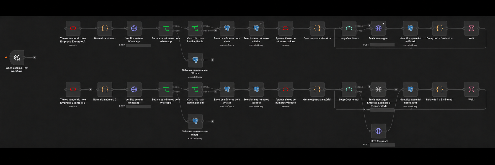
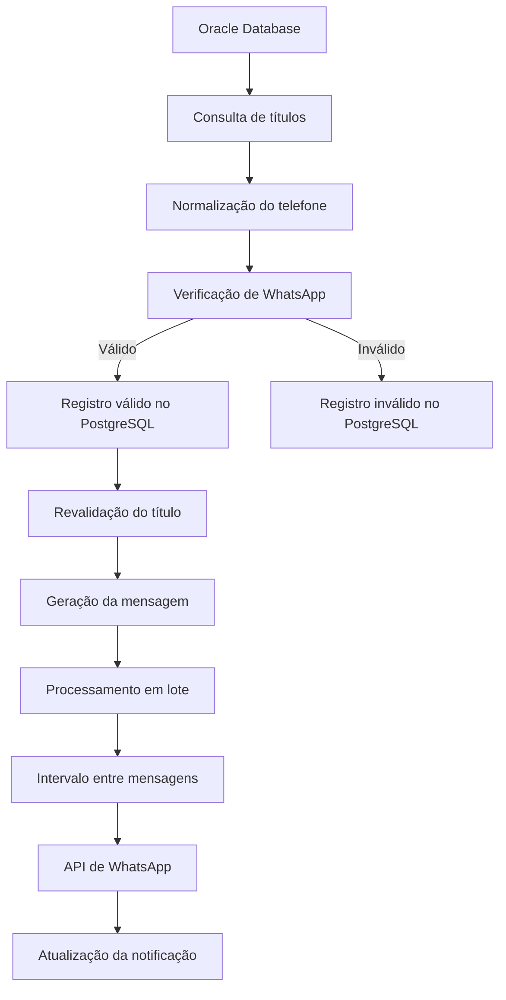

# Bot de Cobrança Automatizada com n8n

Automação de notificações de cobrança via WhatsApp, construída com n8n. O workflow consulta títulos no Oracle Database, valida telefones com uma API de WhatsApp, mantém o controle operacional no PostgreSQL e envia mensagens em lotes.

> O workflow foi sanitizado para portfólio. Configure novamente todas as credenciais e revise filtros comerciais e endpoints antes de qualquer execução. Os filtros de filial e cobrança no SQL são placeholders ilustrativos.

## Funcionalidades

- Consulta automática de títulos vencendo conforme regras configuradas.
- Normalização de telefone brasileiro e verificação de existência no WhatsApp.
- Registro de números válidos e inválidos no PostgreSQL.
- Revalidação dos títulos antes do envio e seleção de itens ainda não notificados.
- Geração dinâmica de mensagens com variações de texto.
- Processamento em lote, com intervalo entre mensagens.
- Atualização do estado de notificação.
- Estrutura demonstrativa com fluxos paralelos para mais de um contexto de cobrança.

## Fluxo

## Estrutura

- `workflows/cobranca-sanitizado.json`: exportação sanitizada para importação no n8n.
- `docs/`: arquitetura, regras do fluxo, integrações, dados, segurança e melhorias.
- `examples/mensagens-exemplo.md`: textos inteiramente fictícios.
- `.env.example`: nomes de variáveis esperadas, sem valores definidos.

## Requisitos e configuração

Use uma instância n8n compatível com os tipos de nodes exportados, acesso ao Oracle e PostgreSQL e uma API de WhatsApp configurada. Após importar, crie no n8n Credentials para Oracle Database, PostgreSQL e autenticação HTTP da API de WhatsApp. Os IDs e os nomes privados dessas credentials foram removidos ou generalizados.

Variáveis listadas em `.env.example` servem como referência de configuração. Não coloque segredos nesse arquivo; mantenha `.env` fora do Git. Configure no n8n somente as variáveis que sua implantação realmente utilizar.

## Normalização de telefone

Os Code nodes removem caracteres não numéricos, tratam o prefixo `0`, tratam o código do país `55`, adicionam o nono dígito quando necessário e retornam o telefone em formato internacional. Um exemplo fictício de formato é `5511999999999`.

## Importação

1. Importe `workflows/cobranca-sanitizado.json` no n8n.
2. Configure novamente as Credentials para cada integração.
3. Substitua os endpoints de placeholder e os filtros SQL de demonstração por valores aprovados para o seu ambiente.
4. Valide o workflow em ambiente de teste antes de ativar envios.

Consulte [docs/seguranca.md](docs/seguranca.md) antes de publicar ou executar uma exportação própria.
