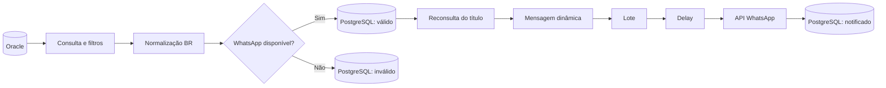

# Arquitetura

O n8n coordena duas trilhas de cobrança semelhantes. Cada trilha consulta títulos no Oracle, normaliza o telefone, consulta a API de WhatsApp e grava o resultado da validação no PostgreSQL. Os títulos elegíveis seguem para reconsulta, composição de mensagem e envio em lote com espera entre itens. Ao final, o PostgreSQL recebe a atualização do estado de notificação.

Os endpoints e alguns filtros comerciais foram substituídos por placeholders no workflow deste repositório. Consulte `docs/fluxo-cobranca.md` antes de adaptar a execução.
